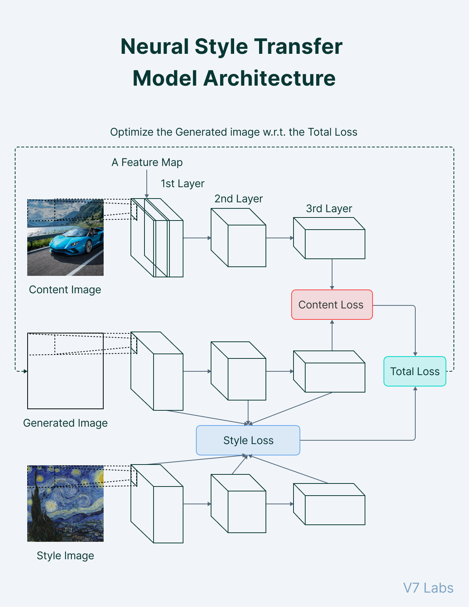
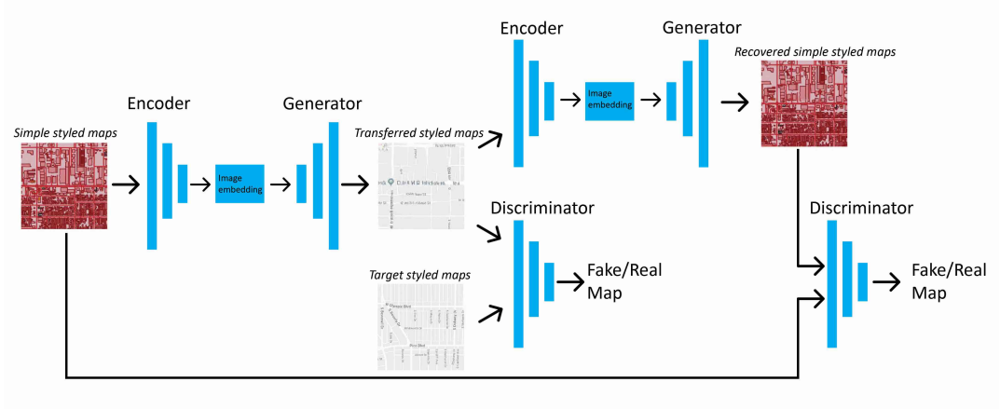

# Neural-Style-Transfer

# About The Project

## Aim

The aim of this project is to use transfer learning and use a trained neural networks to apply style of an input style image to an input content image. 

## Description

Neural style transfer is an optimization technique used to take two images—a content image and a style reference image (such as an artwork by a famous painter)—and blend them together so the output image looks like the content image, but “painted” in the style of the style reference image. This requires an already trained Neural Network (VGG-19 in this case) and while the output is being generated, the parameters of the Neural Network stays the same but the pixels in the ouput image are changed every iteration.
[Image Style Transfer Using Convolutional Neural Networks](https://www.cv-foundation.org/openaccess/content_cvpr_2016/papers/Gatys_Image_Style_Transfer_CVPR_2016_paper.pdf)

We also achieved style transfer using CycleGANs. The beauty of CycleGAN is that X and Y do not have to be paired. This means that we can give CycleGAN any images for X and any images for Y, even if each image in Y is not the direct mapping of the related image in X.

## Tech Stack
This section contains the technologies we used for this project.
* [Keras](https://keras.io/)
* [TensorFlow](https://www.tensorflow.org/)
* [Python](https://www.python.org/)
* [Matplotlib](https://matplotlib.org/)
* [Numpy](https://numpy.org/doc/#)  
* [Google Colab](https://colab.research.google.com/)

## File Structure

    ├── Alex_Net_CIFAR10                   # Folder for Alex_Net Implementation
        ├── assets
        ├── AlexNet notes.md
        ├── AlexNet paper.pdf
        ├── AlexNet_IMplementation_CIFAR10.ipynb
    ├── Coursera Assignments               # Coursera Assignments
        ├── C1_Lakshaya
        ├── C2_Lakshaya
        ├── C4_Lakshaya
        ├── course - 1 : DL and NN_Labeeb
        ├── course - 2 : Improving DNNs and hyperparameter tuning_Labeeb
        ├── course - 4 : CNNs_Labeeb
    ├── Deep Learning                      # Notes on Deep Learning
        ├── C1 - Neural Networks and DL
        ├── C2 - Improving DNNs and HP tuning
        ├── C4 - CNNs
        ├── assets
        ├── Course_1_Lakshaya.md
        ├── Course_2_Lakshaya.md
        ├── Course_4_Lakshaya.md
    ├── GANs                               # Face Generation using GANs
        ├── assets
        ├── face_generation_using_GANs.ipynb
        ├── readme.md
    ├── Linear Algebra (3B1B)              # Linear Algebra Notes
        ├── assets
        ├── Linear_Algebra_Lakshaya.md
    ├── MNIST_Digit_Recognition            # Digit REcognition from scratch
        ├── assets
        ├── Digit_Recognition.ipynb
        ├── tf-digitRecogntion.ipynb    
    ├── Report                             # Project report
    ├── assets                             # assets for README
    ├── cyclegans                          # CyckeGANs Style Transfer Implementation
        ├── StyleTransfer-CycleGANs.ipynb
    ├── src                                # Source code of NEural Style Transfer
        ├── assets
        ├── res
        ├── NST.ipynb
        ├── content.jpg
        ├── cost.py
        ├── dependencies.py
        ├── features.py
        ├── load.py
        ├── main.py
        ├── style.jpg
        ├── style_transfer.py
    ├── vgg-16                             # VGG-16 tensorflow implementation
        ├── assets
        ├── VGG-16_Paper.pdf
        ├── VGG_16.ipynb
    ├── LICENSE                            # MIT license
    ├── README.md                          #readme
    ├── enviroment.yml
    ├── script.sh

# Getting Started

## Prerequisites

- Linux 18.04 or above
- [Conda](https://docs.conda.io/projects/conda/en/latest/user-guide/install/linux.html) installed on system

## Installation

1. Navigate to a directory of your choice and download 'environment.yml' and 'script.sh'. enter following commands in terminal:
    > wget https://raw.githubusercontent.com/Greyless/Neural-Style-Transfer/Labeeb/environment.yml

    > wget https://raw.githubusercontent.com/Greyless/Neural-Style-Transfer/Labeeb/script.sh
2. Run the following commands in order. They create a new conda environment, download the necessary dependencies and the source files in new folder 'nst'.  
**Say yes to any installation asked**. the commands might take a while to complete.

    create environment : 
    >conda env create -f environment.yml

    activate environment : 
    >conda activate nst
    
    change script permission :
    >chmod +x script.sh

    run script :
    >source script.sh

3. You're all set!   To perform Neural Style Transfer on your own images **you can put the content and style image in the nst folder** and run the following command
    > python3 main.py

    it'll ask you to specify the name of content and style images (**including extensions** like .png, .jpg, etc) and then run the style transfer.
    The **results will be saved in 'res' directory**.
    
    if you run into any error regarding some **DNN library or shared library not found**, run the following command before running main.py
    > export LD\_LIBRARY_PATH=LD_LIBRARY_PATH:$CONDA_PREFIX/lib/

---

As a bonus point you can also **run Style Transfer with hyperparameters of your choice**.

To do that run :

    python3 main.py -h

    
for example :
- choose number of iterations : 
    > python3 main.py -n 2000            
    
    runs style style transfer for 2000 iterations.
    default no. of iterations = 5000.

-  choose alpha : 
    > python3 main.py --alpha 1e5

    runs style transfer with alpha = 1e5.
    default alpha = 1e4.
- choose beta value : 
    > python3 main.py --beta 1e-1           

    runs style transfer with beta = 1e-1.
    default beta = 1.

- choose learning rate :     
    > python3 main.py -l 20         
      
    runs style transfer with learning rate = 20.
    default learning rate = 5.

# Theory and Approach

Neural style transfer is an optimization technique used to take two images—a content image and a style reference image (such as an artwork by a famous painter)—and blend them together so the output image looks like the content image, but “painted” in the style of the style reference image.

The principle of neural style transfer is to define two distance functions, one that describes how different the content of two images are, Lcontent, and one that describes the difference between the two images in terms of their style, Lstyle. Then, given three images, a desired style image, a desired content image, and the input image (initialized with the content image), we try to transform the input image to minimize the content distance with the content image and its style distance with the style image.

In summary, we’ll take the base input image, a content image that we want to match, and the style image that we want to match. We’ll transform the base input image by minimizing the content and style distances (losses) with backpropagation, creating an image that matches the content of the content image and the style of the style image.

**Using CycleGANs**

The goal of a CycleGAN is simple, learn a mapping between some dataset, X, and another dataset, Y. For example, X could be a dataset of horse images and Y a dataset of zebra images. CycleGANs are a novel approach for translating an image from a source domain A to a target domain B. One of the cool feature of CycleGANs is that it doesn’t require paired training data to produce stunning style transfer results.

A CycleGAN tries to learn a Generator network, which, learns two mappings. CycleGANs train two Generators and two Discriminators networks. which differs from most of the GANs with a single Generator and Discriminator network.

# Results

## Neural Style Transfer

## CycleGAN Style Transfer

***

# Troubleshooting 
- **alpha/beta ratio** : This is probably the most important part of any NST implementation. We started with a ratio of 5 which resulted in style image completely overshadowing the content image. We referenced the original paper and found **one line which solved the problem** 

- **Noise in generated image**  : Starting with a randomly generated images can lead to some of the noise still persisting till the end, we figured by changing **the hpyerparameters such as learning_rate, epsilon for Adam optimizer, number of iterations, content weight(alpha) and style weight(beta)** can lead to significant reduction in noise

- **Memory leak in tensorflow** : By default tensorflow allocates all of the available gpu on the device to the current process. Having a mere 4GB Nvidia 1650 and loading models as big as VGG-19, it was a great hassle during training. Also memory fragmentation caused regular OOM error. We solved it by **manually killing the process** after each instances and settinig** some enviornment variables in tensorflow**.

- **Training a GAN model** : Its a well known fact that GANs are extremely hard to train. Not having access to high compute resources and training models from scratch required alot of patience and iteration. Google Colab has limits beyond which you have to wait for days to connect to a runtime again. Training locally was the option left. And it was a very time consuming process even for a mere 10 epochs.
- **Getting access to DGX station** : After realizing its literally impossible to train a cycleGAN consisting of 4 Deep ConvNets on our local machine, we started looking for alternatives. It took us a about a week after alot of arrangements to finally get access to VJTI's DGX A100.  It was a huge boost to our progress and allowed us to train for over 100 epochs in just around 2 days.

# Future Works

We enjoyed working on GANs during our project and plan to continue exploring the field for further applications and make new projects. Some of the points that We think this project can grow or be a base for are listed below.

 1. Trying different databases to get an idea of preprocessing different types of images and building models specific to those input image types.
 2. This is a project applied on individual Image to Image translation. Further the model can be used to process black and white sketch video frames to generate colored videos.

# Contributors
* [Labeeb Asari](https://github.com/labeeb-7z)
* [Lakshaya Singhal](https://github.com/Greyless)

# Acknowledgements and Resources
* [SRA VJTI](https://www.sravjti.in/) Eklavya 2022  
* Referred [this](https://www.tensorflow.org/) for understanding the use of tensorflow
* Completed [these](https://www.coursera.org/specializations/deep-learning) 3 courses for understanding Deep Learning concepts like Convulational Neural networks and learnt to make a DL model
* Referred [this](https://www.tensorflow.org/tutorials/generative/pix2pix) for understanding code statements
* Special Thanks to our awesome mentors [Neel Shah](https://github.com/Neel-Shah-29) and [Pratham Shah](https://github.com/shahpratham) who always helped us during our project journey

# License
The [License](LICENSE) used in this project.
